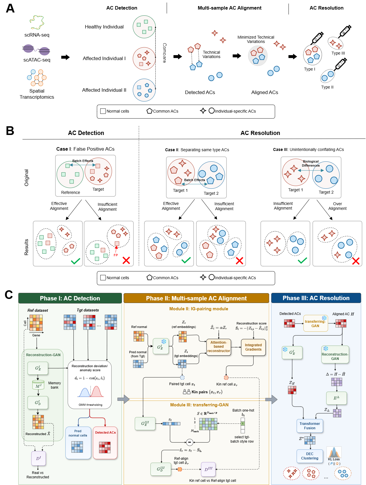

# Detecting and resolving anomalous single cells with RADAR

Detecting anomalous cells from single-cell omics datasets is crucial for understanding disease-associated cellular heterogeneity and supporting precision medicine. However, existing methods often address anomalous-cell detection, multi-sample alignment, and anomalous-cell resolution as separate tasks, making it difficult to characterize anomalous cell populations across multiple samples and modalities in a unified workflow.

We propose **RADAR**, a reference-guided generative framework for anomalous-cell detection, alignment, and resolution in multi-sample single-cell studies. RADAR integrates three key tasks of the cell fate anomaly discovery (CFAD) workflow: detecting anomalous cells in target datasets, aligning multiple target samples to a common reference space, and resolving anomalous cells into biologically meaningful subtypes. Comprehensive evaluations on diverse single-cell datasets demonstrate RADAR's effectiveness in anomalous-cell detection, multi-sample alignment, and fine-grained anomalous-cell resolution.

 

 

---

## Framework of RADAR

RADAR is a three-phase framework designed to identify and characterize anomalous cells across multi-sample single-cell datasets.

<i>Phase I</i> focuses on **anomalous-cell detection**. RADAR trains a reconstruction-based generative model using reference normal cells. The trained model is then applied to target datasets, where cells with unexpectedly large reconstruction deviations are identified as anomalous cells.

<i>Phase II</i> performs **multi-sample alignment**. To avoid treating anomalous biological variation as batch effects, RADAR excludes predicted anomalous cells from alignment training and uses predicted normal target cells to learn reference-guided cross-sample alignment. This phase aligns target datasets into a shared reference space while preserving biologically meaningful cellular structure.

<i>Phase III</i> conducts **anomalous-cell resolution**. After alignment, RADAR integrates cellular embeddings and reconstruction-deviation signals to resolve anomalous cells into fine-grained subtypes, enabling the identification of shared and sample-specific anomalous cell populations across target datasets.

---

## Source codes

All source codes of RADAR are available on [GitHub](https://github.com/Catchxu/RADAR).

---

## Contributors

- [Kaichen Xu](https://github.com/Catchxu): Lead developer; implemented the core framework and designed this website.
- [Kainan Liu](https://github.com/LucaFederer): Developer; contributed to the implementation and development of the project.
- Xiaobo Sun & lab: Provided guidance, support, and computational environment.

---

## Citation

Coming soon.